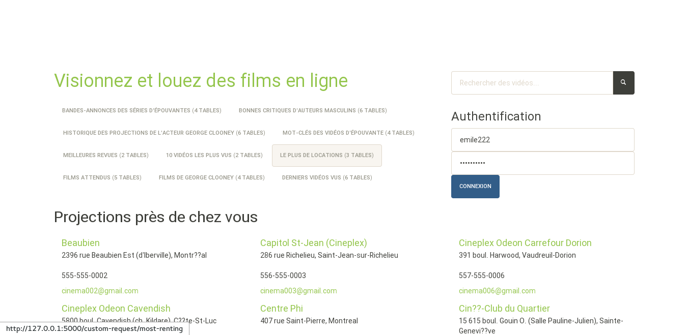
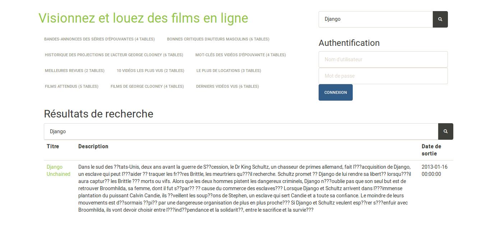
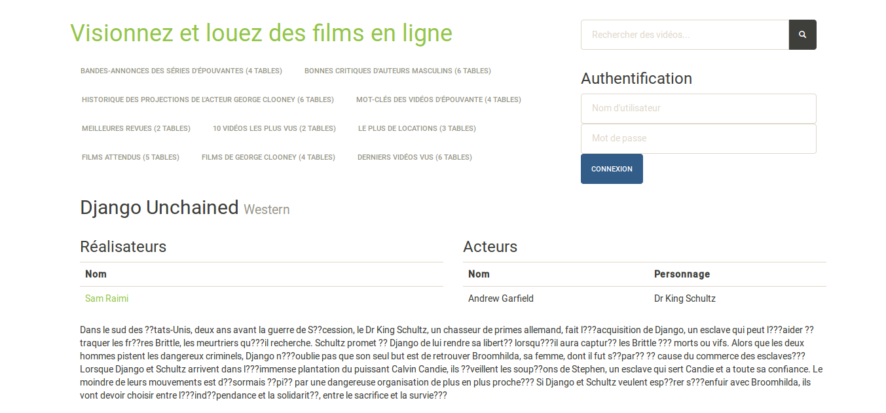

% Rapport de projet final
% Vincent Antaki, Alexandre St-Louis Fortier
% Guillaume Poirier-Morency et Émile Trottier

Fichiers
--------

Le fichier "README.pdf", se trouvant à la racine du projet, contient les
instructions pour l'installation des dépendances ainsi que l'exécution de
l'application. De plus, il est en annexe de ce document.

Les fichiers de requêtes SQL sont structurés de la manière suivante dans le
dossier `sql/`:

Fichier       Utilité
-------       -------
schema.sql    crée la structure de la base
drop.sql      détruit la structure de la base
insertion.sql popule la base de données

Les autres fichiers servent à stocker les requêtes SQL individuelles.

Pour répondre aux exigences du projet, nous avons regroupés les requêtes et les
insertions à l'intérieur "sql/final/LMB.sql" alors que les instructions de
'drop' et de création de table sont dans le fichier "sql/final/LDD.sql".


Implémentation de l'application
-------------------------------

Le projet est basé sur [flask](http://flask.pocoo.org), un micro-framework web
en Python.

Une application peut être facilement décrite à l'aide d'un mécanisme de routage
par décorateur.

```python
@app.route('/')
def home():
    return "<html>Page web!</html>"
```

Des routes ont été déclarées pour

 - afficher les cinémas qui projettent des films
 - authentifier l'usager
 - effectuer une recherche
 - afficher les projections d'un cinéma
 - exécuter une requête et afficher les résultats
 - afficher les données d'un vidéo
 - afficher les données d'un réalisateur

Les routes utilisent diverses petites requêtes paramétrées qui ne figurent pas
dans le fichier "LMD.sql" qui se concentre plutôt sur les 10 requêtes
accessibles par les onglets. Elles servent, entre autre, à valider l'identité
d'un utilisateur ou à récupérer des informations reliées aux vidéos (les
réalisateurs et les acteurs).

##Authentification

Un usager peut s'authentifier à l'aide d'un nom d'utilisateur et d'un mot de
passe. Par exemple, il est possible de se connecter avec l'utilisateur
`e.trottier` avec le mot de passe `abc1234`.




## Onglets

L'exécution des 10 requêtes demandées se fait au sein de la même route,
accessible par les différents onglets. Un fichier contenant la requête est lu
et exécuté sur la base de données. Un template générique s'occupe de présenter
les résultats dans un tableau.


## Recherche

Notre application permet d'effectuer des recherches de vidéos de manière
minimale. Il est à spécifier que la recherche se fait exclusivement à partir de
sous-chaine de la description des vidéos.



À partir de la page de résultat de la recherche, nous pouvons accéder la page
d'un vidéo qui présente les acteurs et les réalisateurs ayant travaillés sur le
video.



S'ils existent dans la base de donnée, la page d'un vidéo offre un lien vers la
page de chacun de ses réalisateurs.


Modèle E-A et Schéma Relationnel
--------------------------------

Le modèle E-A est accessible dans le fichier
"documentation/modeleEntiteAssociation.svg" Il est aussi offert en annexe à ce
document.

Quelques modifications ont été apportées au modèle E-A par rapport à la version
du rapport intermédiaire. Une des modifications concerne le déplacement de la
notre associée aux articles. En effet, nous permettons qu'un article soit
à propos d'un ou plusieurs videos et donc il est plus approprié que la note
soit sur l'association AProposDe. Cela permet à un article de noter
différemment les videos concernés par celui-ci.

Un autre changement est la suppression de l'attribut heure sur les associations
Loue et Projette en raison que le type SQL Date encode l'heure et est donc
suffisant pour notre utilisation.

Évidemment tous ces changements se reflètent dans le schéma relationnel
accessible par le fichier "documentation/Schéma relationnel.txt". De plus, le
schéma corrige les erreurs d'héritage étaient présentent dans le rapport
intermédiaire.

LDD
---

Une des difficultés lors de la création des tables est l'initialisation de la
clé étrangère de la table Serie. En effet, elle introduit une dépendance
circulaire entre la table Serie et la table OeuvreCinematographique. Nous
créons donc la table Serie sans la contrainte, puis l'altérons suite à la
création de la table OeuvreCinematographique.

Mis à part la création des tables, nous avons introduit des procédures et un
trigger. Le trigger sert à initialiser automatiquement l'identifiant unique des
vidéos (ce qui inclue, par héritage, les id des tables OeuvreCinematographique,
BandeAnnonce, Film, Série et Émission). Il est annoté que l'introduction d'un
tel trigger rend difficile la gestion manuelle de l'héritage; c'est pourquoi
nous avons introduit les procédures "insertBandeAnnonce", "insertFilm",
"insertSerie" et "insertEmission".

LMD
---

Tel que mentionné précédemment, les requêtes paramétrée ne sont pas présente
dans le fichier `LMD.sql` car celle-ci ne peuvent être exécutée sans paramètre.
Cette section ce concentre sur les requêtes associées aux onglets. Veuillez
noter que le nom de l'onglet inclue le nombre de table impliqué dans la
requête. Pour faciliter le travail de l'évaluateur, le code associé à une
requête est aussi affiché dans l'onglet.


## Historique des projections de l'acteur George Clooney (6 tables)

```sql
select *
from (Cinema join
    (select noCinema as nc, noVideo as nv from Projette where Projette.noVideo in
    (select noVideo from APourRole where APourRole.id in
    (select id from Acteur where Acteur.id in
    (select id as i from Personne where prenom='George' and nom='Clooney'))))
    on Cinema.id = nc)
```

Le fichier cinema-projet.sql correspond à cette requête. Cette requête affiche
toutes les projections, passées, présentes et futures, d'un film contenant
George Clooney comme acteur (et non les films qu'il a fait comme réalisateur).

## Bonnes critiques d\'auteurs masculins (6 tables)

```sql
select prenom, nom, video.titre, contenu, note, datePublication from Article
    join AProposDe on Article.id = AProposDe.noArticle
    join Journaliste on Article.idAuteur = Journaliste.id
    join Personne on Journaliste.id = Personne.id
    join Serie on noVideo = Serie.id
    join Video on Serie.id = Video.id
    and Personne.sexe = 'homme'
    and note > (select AVG(note) from AProposDe)
```

Le fichier auteur-homme.sql correspond à cette requête. Cette requête trouve
les articles concernant une série offrant une note supérieure à la moyenne des
notes des vidéos et dont l'auteur est un journaliste de sexe masculin. Cette
requête affiche, le nom le nom et le prénom du journaliste, le contenu, la note
et la date de
publication de l'articles ainsi que le nom de la série concernée.

## Derniers vidéos vus (6 tables)

```sql
select titre, description, nomUtilisateur, dateLocation, contenu,
       coalesce(note, 0) as note from Loue
    natural join Fichier
    join Video on Video.id = Fichier.noVideo -- jointure sur le chemin
    left join AProposDe on AProposDe.noVideo = Video.id
    left join Article on Article.id = AProposDe.noArticle
    join Personne on Article.idAuteur = Personne.id
    GROUP BY video.id, titre, description, nomUtilisateur, article.id,
             dateLocation, datePublication, contenu, note
    ORDER BY dateLocation DESC, datePublication DESC
```

Le fichier last-seen-video.sql correspond à cette requête. Cette requête trouve
pour chaque utilisateur les vidéos loués, la dernière date de location du vidéo
par l'utilisateur, ainsi que la note la plus récente donné à ce vidéo par
l'utilisateur. Si on utilisateur n'a pas donné de note, il ne sera pas affiché.

## Films attendus (5 tables)

Le fichier films-attendus.sql correspond à cette requête.

```sql
select Video.titre, Video.dateSortie, AVG(note) as note_moyenne,
       COALESCE(SUM(nbVisionnement), 0) visionnements_bandes_annonces from Film
    join Video on Film.id = Video.id
    join AProposDe on Video.id = AProposDe.noVideo
    left join BandeAnnonce on BandeAnnonce.oeuvreId = video.id
    left join Fichier on Fichier.noVideo = BandeAnnonce.id
    -- and dateSortie > CURRENT_DATE - INTERVAL '1' MONTH -- le dernier mois
    group by video.id, video.titre, dateSortie
    having AVG(note) >= 80 -- commentaires sur la vidéo
    order by AVG(note) desc
```

Récupère les films les plus attendus en considérant le nombre de vues sur leurs
bandes-annonces et la moyenne des notes des critiques. Des jointures sont
faites sur les tables `AProposDe`, `BandeAnnonce`, et `Fichier`. Des `left
join` sont appliqués sur `BandeAnnonce` et `Fichier` pour récupérer toutes les
bandes-annonces et leurs fichiers.

Le tout est trié par note moyenne des critiques et le nombre de visionnement
est récupéré.

Une ligne permettant de considérer les films qui sont sortis à partir du
dernier mois est commenté afin de présenter une bonne quantité de résultats.

## Mot-clés des vidéos d'épouvante (4 tables)

Le fichier `mots-cles-des-videos-epouvante.sql` correspond à cette requête.

```sql
select mot, count(videoId) as nombre_videos,
       AVG(importance) as importance_moyenne from MotCle
    where videoId in
        (select id from Video where genre='Épouvante' or genre='Horreur')
    group by mot
```

Récupère les mots-clés et leur moyenne d'importance des vidéos du genre
« Épouvante » ou « Horreur ». Les résultats sont groupé par mot afin de pouvoir
appliquer une moyenne sur leurs importance. Le nombre de vidéos liés à ce
mot-clé est affiché.

## Bandes-annonces des séries d\'épouvantes (4 tables)

Le fichier `bande-annonce-des-series-epouvante.sql` correspond à cette requête.

```sql
select video.titre, video.description, fichier.chemin from serie
    join video on video.id = serie.id
    join bandeannonce on bandeannonce.oeuvreId = serie.id
    join fichier on fichier.noVideo = bandeannonce.id
    where genre = 'Épouvante'
    order by video.dateSortie DESC
```

Cette requête récupère les bande-annonces des dernières séries d'épouvante.

La jointure est faite à partir des séries du genre « Épouvante » sur les
`BandeAnnonce` reliés et leurs fichiers afin de proposer les fichiers
à télécharger à l'usager.

Les résultats sont triés par date de sortie afin d'avoir les séries les plus
récentes en premier.


## Films de George Clooney (4 tables)

```sql

select titre, description,
       DECODE(Realise.id, null, '--', 'Réalisateur') as realisateur,
       DECODE(APourRole.id, null, '--', nomPersonnage) as nom_personnage
    from Video
    left join Realise on Realise.noVideo = Video.id
    left join APourRole on APourRole.noVideo = Video.id
    where Realise.id in (select id as i from Personne
                             where prenom='George' and nom='Clooney')
    or APourRole.id in (select id as i from Personne
                            where prenom='George' and nom='Clooney')
```

Le fichier george-clooney-movies.sql correspond à cette requête. Cette requête
affiche le titre, la description ainsi que possiblement la fonction de George
Clooney (le nom de son personnage dans le cas d'un rôle) dans l'ensemble des
vidéos l'impliquants à titre de réalisateur ou d'acteur.

`decode` agit comme une ternaire en comparant le permier argument avec le
deuxième. Le troisième est retourné en cas de vérité, sinon le quatrième est
retourné. On peut ainsi afficher « Réalisateur » au lieu d'un identifiant.

## Meilleures revues (2 tables)

```sql
select titre, description, avg(note) as note_moyenne from Video
    join AProposDe on Video.id = AProposDe.noVideo
    group by video.id, video.titre, description
    order by avg(note) desc
```

Cette requête, stocké dans `best-review.sql` récupère les vidéos qui ont eu les
meilleurs critiques avec leurs notes moyennes. La table `AProposDe` permet
d'accéder à une note pour un vidéo et par un article, alors il suffit de faire
une jointure entre elle est les vidéos et de grouper sur `video.id` afin de
pouvoir calculer la moyenne des notes par vidéo.

Les résultats sont ensuite triés par moyenne de note.

## Le plus de locations (3 tables)

```sql
select * from
    (select noVideo, titre, count(*) as locations from Loue
        natural join Fichier -- jointure sur le chemin
        join Video on Video.id = Fichier.noVideo
        group by noVideo, titre
        order by locations desc)
    where rownum <= 10
```

Cette requête (fichier `most-renting.sql`) trouve les dix (10) vidéos les plus
loués en considérant le nombre d'entrée dans la table `Loue` qui se réfère
à chaque vidéo par une jointure. Les résultats sont groupés par vidéo et trié
par nombre de location. Le titre et le nombre de locations sont affichés.

## 10 vidéos les plus vus (2 tables)

```sql
select * from
    (select titre, nbVisionnement, nbTelechargement from Video
    join Fichier on Video.id = Fichier.noVideo
    order by nbVisionnement desc, nbTelechargement desc)
    where rownum <= 10
```

Cette requête (`ten-most-viewed-video.sql`) récupère les 10 vidéos les plus vus
en considérant le nombre de visionnements sur leurs fichiers. La jointure est
faite entre la table `Video` et `Fichier` et un simple tri est appliqué sur la
colonne `nbVisionnement`. En cas d'égalité, le nombre de téléchargement tranche
dans le tri.
